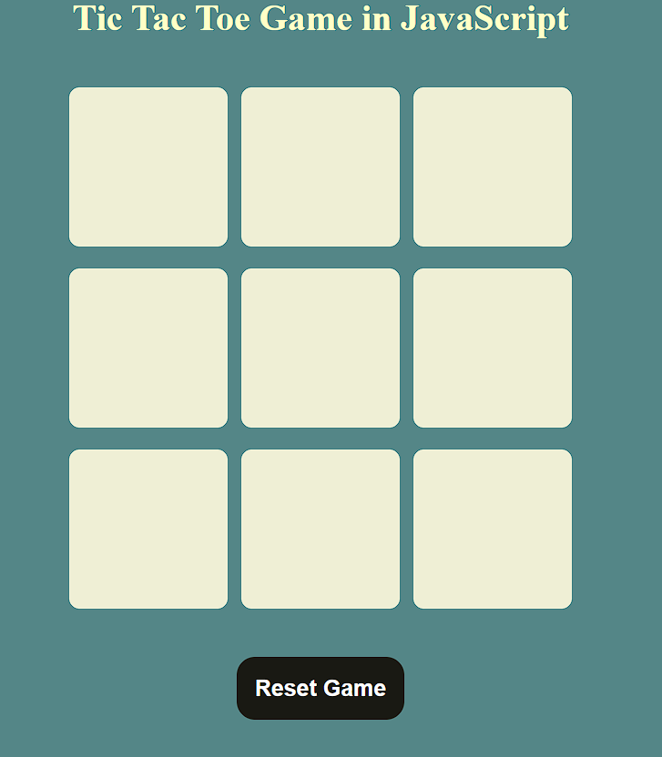
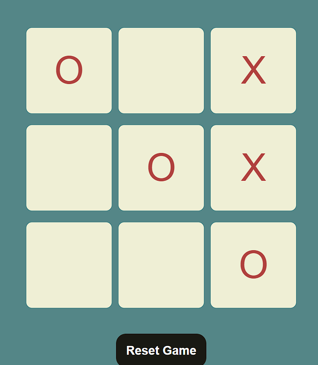

# Tic Tac Toe Game 🎮

A classic Tic Tac Toe game built using HTML, CSS, and JavaScript. Play this two-player game to see who claims victory!

## Features 🌟

- **Interactive Gameplay**: Take turns as "O" and "X" to compete.
- **Winner Announcement**: Displays the winner at the end of the game.
- **Reset and New Game Options**: Easily reset the game or start a new round.
- **Stylish Design**: A modern and clean interface for an enjoyable gaming experience.


## Installation Steps 🛠️

1. Clone the repository:
 
2. Open the `index.html` file in your browser:
   ```bash
   open index.html
   ```

## How to Play 🕹️

1. Player "O" always starts the game.
2. Click on any empty box to mark your turn.
3. Alternate turns between players "O" and "X".
4. The first player to align three marks in a row, column, or diagonal wins.
5. Use the **Reset Game** button to restart or **New Game** to start fresh after a match.

## Technology Stack 🛠️

- HTML5
- CSS3
- JavaScript (ES6+)

## Code Highlights ✨

### Winner Checking Logic:
```javascript
const ChekWinner = () => {
    for (let pattern of winPatterns) {
        let pos1Val = boxes[pattern[0]].innerText;
        let pos2Val = boxes[pattern[1]].innerText;
        let pos3Val = boxes[pattern[2]].innerText;

        if (pos1Val !== '' && pos2Val !== '' && pos3Val !== '') {
            if (pos1Val === pos2Val && pos2Val === pos3Val) {
                showWinner(pos1Val);
            }
        }
    }
};
```

### Reset Functionality:
```javascript
const resetGame = () => {
    trunO = true;
    enableBox();
    msgContainer.classList.add("hide");
};
```

## Screenshots 🖼️

### Main Interface:





## Future Enhancements 🚀

- Add AI for single-player mode.
- Track scores for both players.
- Implement a customizable grid size (e.g., 4x4 or 5x5).

## Acknowledgments 🙏

- Design inspired by various online games.
- CSS styles customized for a seamless experience.

## License 🔒

This project is licensed under the MIT License.

---

I’m a beginner coder on a mission to create and learn. Your feedback means a lot!  
Contact me at: [derkaran@gmail.com](mailto:derkaran@gmail.com)  
Connect with me on LinkedIn: [](https://www.linkedin.com/in/karan-der/)

--- 
